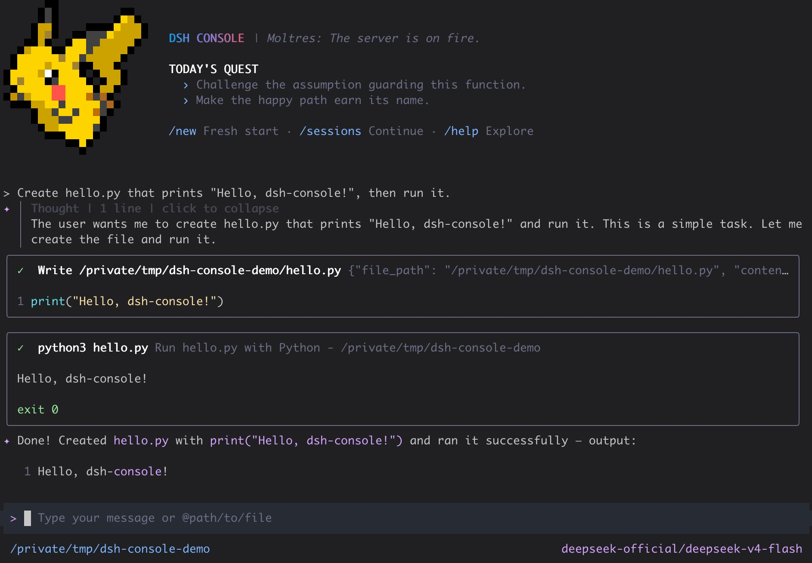

# DSH Console

English | [简体中文](README.zh.md)

DSH Console is a DSH-native terminal frontend for [DeepSeek Harness](https://github.com/deepseek-ai/DeepSeek-Harness), built with TypeScript and React/Ink. Chat with agents, inspect tool work, switch models, and resume sessions without leaving your terminal.



> [!WARNING]
>
> DSH Console is currently a public alpha. Its DSH contracts and persisted sessions are real, but commands and UI details may still change before the first stable release.

## Quick start

With Node.js 24 or newer, install DeepSeek Harness and DSH Console normally:

```sh
npm install --global @deepseek-ai/dsh @cofy-x/dsh-console
dsh-console
```

The `dsh-console` launcher initializes or locates its DSH profile, then starts the interactive TUI.

This Console release is verified from the npm-default DSH `0.1.1-rc.2` through the current source release `0.1.2-alpha.2`. The upper bound advances only after each new DSH release passes an API audit and integration tests; users do not need to pin DSH in the install command.

Start directly with a prompt:

```sh
dsh-console --prompt "hello"
```

Continue the latest resumable Session for the current directory, or resume an exact Session ID. An initial prompt can be supplied after either option:

```sh
dsh-console --continue
dsh-console --resume dsh-console-01234567-89ab-cdef-0123-456789abcdef --prompt "continue this work"
```

If the official DeepSeek provider is missing a credential that DSH can configure, DSH Console opens a masked setup dialog before submitting the first prompt and writes the credential through DSH. Read-only environment credentials and providers without a Console setup adapter continue to use their existing DSH configuration paths. DSH Console never maintains a separate credential store.

Public Alpha releases use prerelease versions such as `0.1.0-alpha.x` while the current published Console remains available through npm's default install path.

## What you get

- Streaming, multi-turn conversations with Markdown, reasoning, interruption, and usage display
- DSH tool calls, results, approvals, questions, todo state, and a browsable `/tools` catalog
- DSH-native model selection, image input from `@path` or the clipboard, and isolated prompt completion
- Persistent DSH sessions with startup continuation, `/new`, `/sessions`, and `/resume`
- Local shell mode, themes, settings, terminal-safe cleanup, and continued operation in a regular PTY or embedded terminal such as Orca

## Interactive commands

| Command                | Purpose                                                  |
| :--------------------- | :------------------------------------------------------- |
| `/model`               | Select the active DSH model                              |
| `/new`                 | Start a fresh conversation                               |
| `/sessions`            | Browse resumable sessions for the current directory      |
| `/resume [session-id]` | Browse sessions or resume a full Session ID              |
| `/tools`               | Inspect tools exposed by the active DSH agent            |
| `/theme`               | Select the terminal theme                                |
| `/settings`            | Edit Console settings                                    |
| `!command`             | Run a command locally without submitting it to the model |

During an active turn, `Ctrl+C` cancels the current DSH operation. While idle, `Ctrl+C` disposes the runtime, restores the terminal, and exits.

## Sessions and local data

DSH is the source of truth for conversation history. DSH Console lists resumable top-level `dsh-console-*` sessions for the current working directory, replays their canonical DSH event surface, and resumes them through DSH. It does not maintain a parallel client-owned session database.

The active `DSH_HOME` controls profiles, JSONL session logs, and attachment objects. Set it to isolate an environment:

```sh
DSH_HOME=/tmp/dsh-console-home dsh-console --prompt "hello"
```

## DSH-native by design

DeepSeek Harness owns agent execution, models, provider settings and credentials, sessions, tools, approvals, attachments, persistence, and canonical events. DSH Console owns terminal interaction, input preparation, presentation, and focused adapters to those public DSH services.

- Runtime adapters consume official DSH canonical types and project them into stable Console view models before React renders them.
- Session replay and live streaming share the same event projector, keeping text, reasoning, tools, todo state, usage, errors, and interruptions consistent.
- Images are admitted through the DSH attachment service before a user turn is created; failed admission never degrades silently to text-only input.
- Prompt completion uses a separate temporary agent/session and never writes to the active conversation.

The published package contains the launcher, compiled Console runtime, DSH plugin bundle, license, and attribution notices. Runtime plugins remain provided by the selected DSH profile.

## Alpha boundaries

The current release intentionally does not provide cross-directory session search, session rename/delete/fork, generic file/PDF/audio/video attachments, native terminal image protocols, a web UI, or a standalone provider/auth layer.

## Development

Install the workspace and run the same entry point exposed by the published package:

```sh
pnpm install --frozen-lockfile
pnpm run build:cli
pnpm start -- --prompt "hello"
```

Development requires Node.js 24 or newer and pnpm 11. The main quality checks are:

```sh
pnpm run format:check
pnpm run lint
pnpm run typecheck
pnpm run build:cli
pnpm run test:ci
pnpm run test:integration:dsh
pnpm run test:package
```

`format:check` incrementally checks changed files without modifying them. `test:integration:dsh` composes the real Cordis/DSH runtime with a deterministic fake LLM adapter. `test:package` packs the public package, installs it in an isolated directory, initializes an isolated `DSH_HOME`, and exercises the installed launcher.

## License and attribution

DSH Console is licensed under the Apache License 2.0. See [LICENSE](LICENSE), [NOTICE](NOTICE), and [THIRD_PARTY_NOTICES.md](THIRD_PARTY_NOTICES.md). Portions of the terminal UI and supporting utilities are derived from Gemini CLI and retain their original copyright notices.
